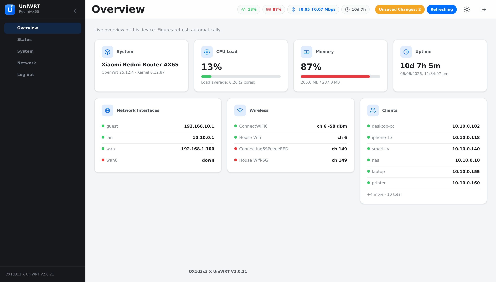
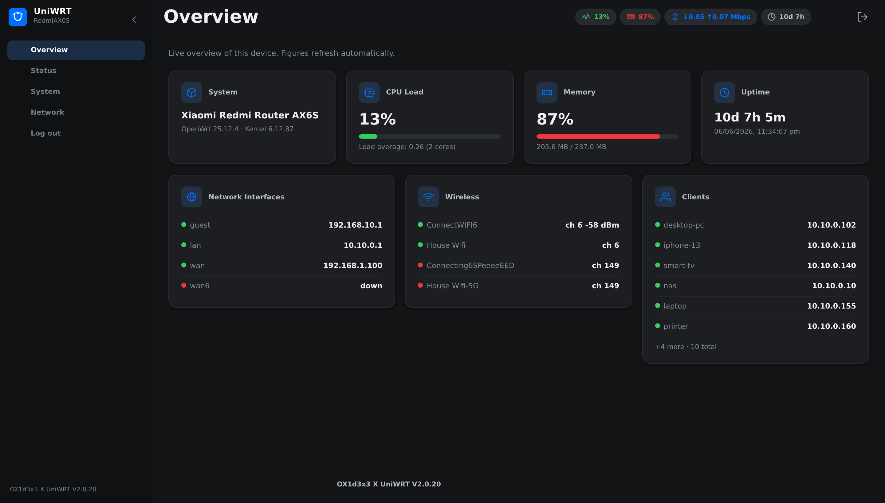
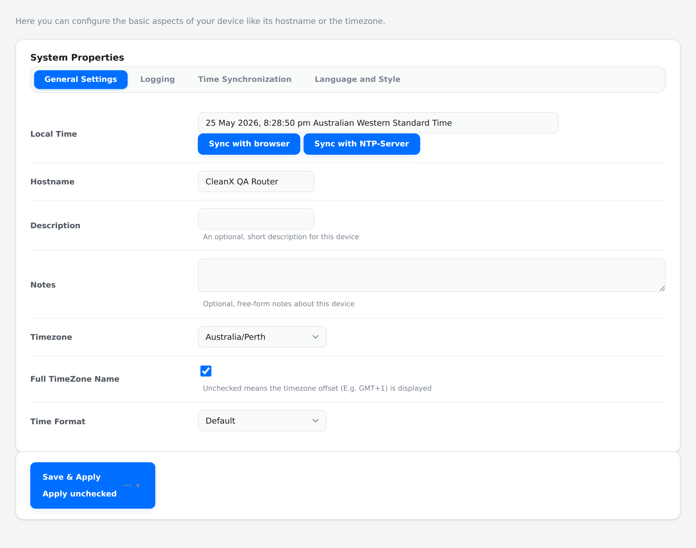
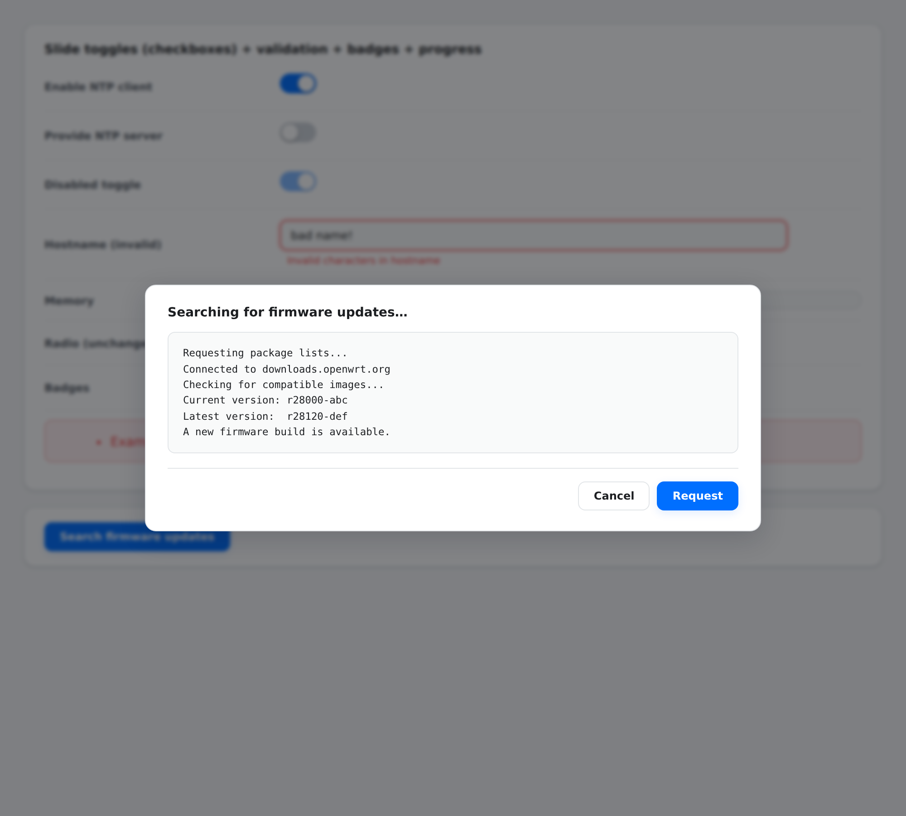
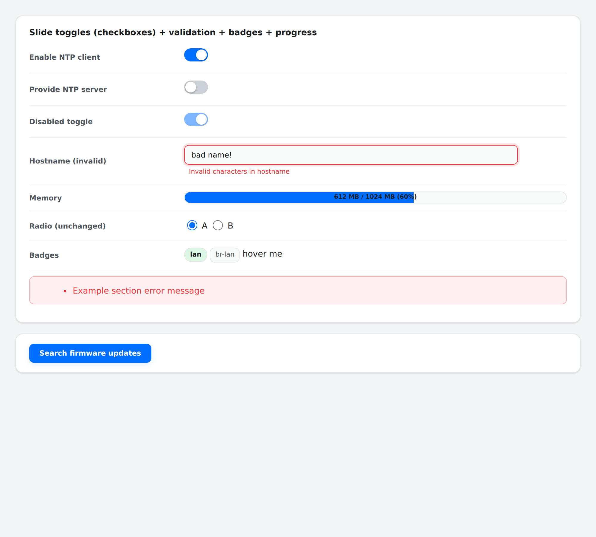
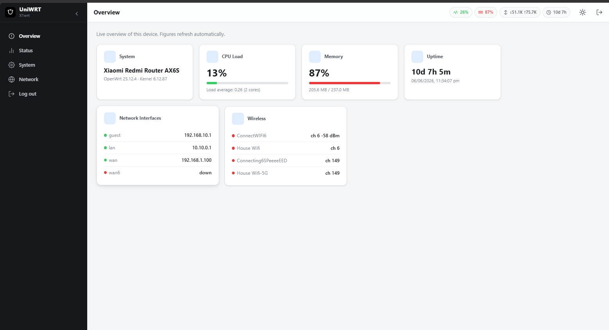

<div align="center">


# UniWRT Portal

**A modern, standalone LuCI theme for OpenWrt — a clean controller-style dashboard with a collapsible navigation rail, live status widgets, and light / dark / auto theming.**

[](https://github.com/ox1d3x3/uniwrt-luci/actions/workflows/build.yml)
[](https://github.com/ox1d3x3/uniwrt-luci/releases)
[](https://github.com/ox1d3x3/uniwrt-luci/releases)
[](./LICENSE)


</div>

---

## Preview

<p align="center">
  
</p>

<table>
  <tr>
    <td width="50%"></td>
    <td width="50%"></td>
  </tr>
  <tr>
    <td align="center"><sub><b>Dark mode</b></sub></td>
    <td align="center"><sub><b>In-page form tabs (System &rarr; Logging / Time Sync &hellip;)</b></sub></td>
  </tr>
  <tr>
    <td width="50%"></td>
    <td width="50%"></td>
  </tr>
  <tr>
    <td align="center"><sub><b>Centred modal output (package / firmware)</b></sub></td>
    <td align="center"><sub><b>Slide toggles, validation, progress, badges</b></sub></td>
  </tr>
</table>

<details>
<summary><b>Running on a real device</b> (Xiaomi Redmi Router AX6S &middot; OpenWrt 25.12.4)</summary>

<br>



</details>

---

## Features

* **Standalone full shell** — its own HTML shell (head, navigation rail, top bar, login) on the ucode template engine, not a restyle over the bootstrap theme. This removes the entire class of cascade-conflict bugs.
* **Collapsible navigation rail** — client-side menu with pin / collapse, sliding indicators, and sticky sub-navigation tabs, built from LuCI's live menu tree.
* **Live overview dashboard** — System, CPU load, Memory, Uptime, Network Interfaces, Wireless and Clients tiles, refreshed every 5 seconds over `ubus`.
* **Live header status bar** — at-a-glance CPU / Memory / Throughput (in Mbps) / Uptime chips with status colours.
* **Light / Dark / Auto** — no-flash theme resolution with independent, configurable accent colours per mode.
* **Slide-toggle switches** — checkboxes render as iOS-style on/off switches; native form behaviour is preserved underneath.
* **Native-feel components** — styled tabs, modals, tooltips, progress bars, interface / zone badges, validation states and diagnostics layouts.
* **Config-driven** — every option lives in `/etc/config/uniwrt` and is editable from the GUI or via UCI; settings persist across upgrades.
* **Dual packaging** — ships as `.ipk` (opkg, 23.05 / 24.10) and `.apk` (Alpine apk, 25.x) from one CI matrix.

---

## Installation

Download the artifact that matches your OpenWrt release from the [Releases](https://github.com/ox1d3x3/uniwrt-luci/releases) page.

### OpenWrt 25.x (apk)

```sh
# copy the .apk to the router first, then:
apk add --allow-untrusted ./luci-theme-uniwrt-2.0.33-r1.apk
```

`--allow-untrusted` is required for a manually-downloaded, unsigned package. If you publish a signed feed, install its public key into `/etc/apk/keys/` instead and drop the flag.

### OpenWrt 24.10 / 23.05 (opkg)

```sh
# copy the .ipk to the router first, then:
opkg install ./luci-theme-uniwrt_2.0.33-1_all.ipk
```

### Activating the theme

On a **fresh install** UniWRT sets itself as the active theme automatically. On an **upgrade** it will *not* override a theme you have since chosen — it only keeps itself in the selectable list. To switch manually at any time, pick **UniWRT** under *System &rarr; System &rarr; Language and Style*, or from the CLI:

```sh
uci set luci.main.mediaurlbase=/luci-static/uniwrt
uci commit luci
/etc/init.d/uhttpd restart
```

---

## Configuration

All settings are stored in `/etc/config/uniwrt` and are editable from the GUI (*System &rarr; UniWRT Theme*) or via UCI.

```
config global 'global'
    option mode           'auto'      # auto | light | dark
    option accent         '#006fff'   # accent colour (light mode)
    option dark_accent    '#4797ff'   # accent colour (dark mode)
    option status_bar     '1'         # 1 = show live header status bar
    option overview       '1'         # 1 = show the live overview dashboard entry
    option font_size      '14'        # base font size in px
    option rail_collapsed '0'         # 1 = start with the rail collapsed on desktop
```

Example — force a dark theme with a green accent from the CLI:

```sh
uci set uniwrt.global.mode='dark'
uci set uniwrt.global.dark_accent='#38cc65'
uci commit uniwrt
```

The file is registered as a conffile, so your settings persist across package upgrades.

> **A note on fonts.** UniWRT deliberately uses the platform's native `system-ui` font stack rather than bundling a webfont. Routers are flash-constrained and frequently offline, so a remote webfont would either bloat the package or fail to load. The native stack renders instantly and looks clean on every platform.

---

## Firmware upgrades (Attended Sysupgrade)

The **Attended Sysupgrade** portal builds your new firmware on OpenWrt's official build servers, which only know packages from the **official feeds**. Because `luci-theme-uniwrt` is installed from this repo's releases (sideloaded), the build server cannot include it and the request fails with:

```
Impossible package selection: missing (luci-theme-uniwrt)
```

This is expected for *any* sideloaded package — it is not a bug in the theme or in your device. To upgrade via the portal:

1. Enable the package editor: `uci set attendedsysupgrade.client.advanced_mode='1' && uci commit attendedsysupgrade`, then reload the upgrade page (the setting is also exposed in the Attended Sysupgrade configuration).
2. In the request form's **Packages** list, **remove `luci-theme-uniwrt`**, then request the build and flash as usual with *Keep settings* enabled.
3. After the reboot, **reinstall the theme** (the matching `.apk` / `.ipk` from [Releases](https://github.com/ox1d3x3/uniwrt-luci/releases), or `uniwrt-apply.sh`). Your `/etc/config/uniwrt` settings survive the upgrade, so the theme returns exactly as configured.

> Until the theme is reinstalled, LuCI may render unstyled because `luci.main.mediaurlbase` still points at the removed theme. Reinstalling fixes it; or switch back temporarily with `uci set luci.main.mediaurlbase='/luci-static/bootstrap' && uci commit luci`.

---

## Building from source

### Option A — GitHub Actions (recommended)

This repo ships `.github/workflows/build.yml`, which runs a static QA gate (`qa-static.sh`) and then builds three OpenWrt releases with the official `openwrt/gh-action-sdk` (pinned to `@main`), producing both `.ipk` (23.05.x / 24.10.x) and `.apk` (25.12.x+) artifacts. Every push to `main` / `master` publishes a rolling `nightly` pre-release; pushing a `v*` tag publishes a normal release:

```sh
git tag v2.0.33
git push origin v2.0.33
```

The release also bundles `uniwrt-apply.sh`, a one-shot router-side helper that auto-detects the local `.ipk` / `.apk`, installs it, activates UniWRT, clears the LuCI cache and restarts the web UI.

> **SDK image tags:** the matrix pins `x86_64-23.05.6`, `x86_64-24.10.6`, and `x86_64-25.12.4`. If a build reports `manifest unknown`, that point-release SDK image isn't published yet — bump the tag to one that exists (or use `x86_64-SNAPSHOT` for the apk row).

### Option B — local SDK build

```sh
# 1. download and extract the SDK for your target/branch, then inside it:
echo "src-link uniwrt /path/to/uniwrt-luci" >> feeds.conf.default
./scripts/feeds update uniwrt
./scripts/feeds install -a -p uniwrt

# 2. enable the package
make menuconfig            # LuCI -> Themes -> luci-theme-uniwrt  (M)

# 3. build
make package/luci-theme-uniwrt/compile V=s

# 4. the package lands under bin/packages/<arch>/uniwrt/
```

> The CSS minifier (`csstidy`) is intentionally disabled in the Makefile (`CONFIG_LUCI_CSSTIDY:=`). It is a CSS2-era tool that mangles modern properties such as `backdrop-filter` and multi-stop gradients, so the committed CSS ships to the device byte-for-byte.

---

## Project layout

```
uniwrt-luci/
├── .github/workflows/build.yml          # QA + dual IPK/APK CI matrix
├── qa-static.sh                         # static QA gate (run in CI and locally)
├── uniwrt-apply.sh                      # router-side one-shot install/activate helper
├── docs/screenshots/                    # README preview images
├── README.md
├── LICENSE
└── luci-theme-uniwrt/
    ├── Makefile
    ├── ucode/template/themes/uniwrt/
    │   ├── header.ut                     # full HTML shell (head, rail, top bar)
    │   ├── footer.ut                     # shell close + client bootstrapping
    │   ├── sysauth.ut                    # themed login page
    │   └── version
    ├── htdocs/luci-static/uniwrt/
    │   ├── css/cascade.css               # light / base layer
    │   ├── css/dark.css                  # dark overrides (injected, media-toggled)
    │   └── img/uniwrt-logo.svg
    ├── htdocs/luci-static/resources/
    │   ├── menu-uniwrt.js                # client-side rail/menu builder
    │   ├── status-uniwrt.js              # live header status widgets
    │   └── view/uniwrt/
    │       ├── settings.js               # settings page (form.Map)
    │       └── overview.js               # live overview dashboard
    └── root/
        ├── etc/config/uniwrt             # default settings (conffile)
        ├── etc/uci-defaults/30_luci-theme-uniwrt
        └── usr/share/
            ├── luci/menu.d/luci-theme-uniwrt.json
            └── rpcd/acl.d/luci-theme-uniwrt.json
```

---

## How it works

* **Shell** — `header.ut` / `footer.ut` render the complete page (rail, top bar, content frame) and inject the dark layer inline so the correct theme is resolved before first paint (no flash).
* **Menu** — `menu-uniwrt.js` builds the rail and sub-nav from LuCI's live menu tree (`L.ui.menu.load()`), matching the link-building and active-path detection of current standalone themes.
* **Widgets** — `status-uniwrt.js` and `overview.js` use `rpc.declare()` + `L.resolveDefault()` + the `poll` API to query `ubus` (`system info` / `board`, `luci-rpc getNetworkDevices` / `getWirelessDevices` / `getHostHints`, `network.interface dump`, `network.device status`, `iwinfo`) on a 5-second cadence.
* **Permissions** — `acl.d/luci-theme-uniwrt.json` grants exactly the read scopes the widgets need (plus `/proc/cpuinfo` for core-count detection) and write access only to its own `uniwrt` UCI config.

---

## Compatibility

* **OpenWrt 23.05, 24.10, 25.x** with LuCI on the ucode template engine.
* On 25.x the package manager is **apk**; on 23.05 / 24.10 it is **opkg**. A `.ipk` cannot be installed on an apk system and vice-versa — use the matching artifact.
* `LUCI_PKGARCH:=all` — the package is architecture-independent.

---

## Contributing

Issues and pull requests are welcome. If you hit a rendering bug, a screenshot plus the page path (e.g. *Network &rarr; Firewall &rarr; Port Forwards*) and your OpenWrt / LuCI version makes it much faster to reproduce. Before opening a PR, run the static gate locally:

```sh
./qa-static.sh
```

---

## Changelog

### v2.0.33
* **Fixed the empty collapsed rail — the category icons now actually appear on real devices.** Root cause: LuCI's loaded menu tree wraps everything in a single `admin` node, so the theme's category switcher saw only one top-level child and never rendered (`#u-rail-modes` stayed empty on every real device; the items visible when expanded were the sidebar, which collapse hides — hence the blank column). The renderer now descends into the `admin` wrapper so the true categories (Overview / Status / System / Network / Log out) populate the switcher, with corrected links (`admin/<category>`) and active-path detection. Verified by running the shipped renderer against a device-shaped tree: five icon tabs render with correct hrefs and active state.
* **Collapsed icons are interactive the way you'd expect:** clicking a category icon expands the sidebar *and* navigates to that category, so the page opens with its sub-options visible; clicking the logo, the arrow or empty rail space just expands.

### v2.0.32
* **Collapsed arrow repositioned: docked directly under the logo** (in its own slot just below the head divider, horizontally aligned with the mark) instead of at the very bottom of the rail. The travel animation is unchanged — clicking it still glides the pin up to its top-right position in one continuous motion as the rail expands, and back down under the logo when collapsing. The icon column starts below the pin slot, so nothing can overlap.

### v2.0.31
* **The collapse arrow now docks at the bottom of the collapsed rail and travels.** The cramped arrow-under-the-logo is gone: collapsed, the pin sits centred at the bottom of the rail (well clear of the logo, with its own subtle backing); on click it glides in one continuous animation up to its usual top-right position while the rail widens, rotating 180° along the way — and makes the reverse journey when collapsing. Implemented by anchoring the pin absolutely against the rail with calc() positions on both axes so the whole bottom-to-top journey interpolates seamlessly, coordinated with the rail width transition.

### v2.0.30
* **Collapsed rail: visible expand arrow restored (no overlap).** The collapsed head now stacks the logo on top with the expand chevron in its own row directly beneath it, followed by the category icons — nothing overlaps and the affordance is always visible. Clicking anywhere in the collapsed rail (logo, arrow or icon) still expands the full menu.
* **Static assets are now cache-busted.** `cascade.css`, the favicon and the brand logo are served with a `?v=<theme version>` token, so browsers can never keep using a stale stylesheet after an upgrade. A stale cached stylesheet from an older version is the most likely cause of a collapsed rail rendering blank (older CSS hid the icon column entirely) — after installing this version, do one hard refresh (Ctrl+Shift+R) to clear the last unversioned copy; from then on every release refreshes automatically.
* **Less polling on the Overview page.** The header status bar now shares its `system info` reading with the dashboard, so the heaviest page issues one `system info` ubus call per 5-second cycle instead of two. All looks, functions and animations are preserved.

### v2.0.29
* **Reworked the collapsed rail interaction.** The hover chevron that overlapped the logo is gone. Collapsed now shows the logo plus all top-level category icons (with tooltips and an accent edge on the active one), and **clicking anywhere in the collapsed rail — logo or any icon — re-expands the full menu** instead of navigating. The expand/collapse pin appears only when expanded, and its tooltip reflects the state.
* **Icon polish.** Collapsed icons are larger (20 px) in consistent 44x40 hit targets with proper hover pills and a left accent indicator for the active category.
* **Performance pass.** Dashboard cards now use CSS layout/style containment so their 5-second live-data updates can no longer trigger page-wide reflow; card hover animates only the composited transform (no more box-shadow paint animation); button and login-button transitions dropped the expensive `filter`/`box-shadow` animations. Combined with the existing poll-pausing and pre-paint state restore, interaction and scrolling are noticeably smoother, especially on slower machines.
* **Documented Attended Sysupgrade.** The portal's "Impossible package selection: missing (luci-theme-uniwrt)" error is expected for any sideloaded package: the official build servers only know official-feed packages. The README now has a step-by-step section (enable Advanced Mode, remove the theme from the package list, flash, reinstall the theme; settings survive).

### v2.0.28
* **The collapsed rail now keeps the logo.** Previously collapsing hid the brand entirely and left only the expand chevron. The logo now stays centred in the collapsed rail head; since a 66 px rail has no room for the logo and the chevron side by side, the expand control covers the head and fades in on hover/focus — so the mark is what you see at rest and the whole head is one large, obvious expand target.
* The rail toggle's tooltip/aria-label now reflects the current state ("Expand menu" when collapsed, "Collapse menu" when expanded) instead of always reading "Collapse menu".

### v2.0.27
* **Fixed the collapsed sidebar showing clipped/distorted labels.** When the navigation rail was collapsed, the item labels were not actually hidden — they stayed in place and were cut off by the narrow rail (and the mode-tab labels were bare text nodes with no way to hide them). Collapsing now shows the top-level category **icons centered with their labels hidden**, the contextual sub-nav is hidden, and the rail head centers the expand control. Expanding restores the full labels as before.

### v2.0.26
* **Fixed: unchecking "UniWRT Overview page" did not remove the Overview entry from the menu** (reported on 25.x). LuCI evaluates a menu entry's `uci` dependency only when it builds its cached index (`/tmp/luci-indexcache.*`), and that cache is keyed on the menu.d file list — not on UCI state — so toggling the option never invalidated it and the entry kept its baked-in state until the cache was cleared (reinstall/reboot). The Overview entry is now always registered and its visibility is controlled **live in the client menu** from the current setting (exposed by the header), so the toggle takes effect on the next page reload, both on and off, with no cache-clear needed.

### v2.0.25
* **Fixed the Live Throughput card reading near-zero.** On DSA switches (e.g. the MT7622 in the Redmi AX6S) the `wan` port's software byte counter stays near zero under hardware flow offload, so the card showed ~0 Mbps while the header chip (which already followed the switch conduit) showed the real rate. The card now uses the same conduit-aware resolution — following the bridge member and the DSA `conduit` device — so its numbers match the header.
* **Added throughput statistics** to the card: **Peak** down/up (highest rate measured, persisted), **Last 24 h** down/up, and **Since restart** total down/up. These are derived from the interface byte counters, which keep accumulating on the device even while the dashboard is closed, so sparse snapshots stored in the browser let the 24 h figure reflect true traffic over the window (it shows the actual window length, e.g. "Last 6 h", until ~24 h of reference history has built up; a router reboot resets the counters and the stored history).

### v2.0.24
* **Fixed the Quick Actions 404.** The dashboard's Quick Actions tiles hardcoded dispatcher paths (e.g. `admin/status/syslog`), but those paths differ between LuCI builds — so on some firmwares a tile 404'd even though the sidebar link worked. Quick Actions now resolve each target against the **live menu tree** (the same source the sidebar uses): they try known candidate paths, fall back to a keyword search of the tree, and **omit any tile whose page isn't registered on the device** — so a Quick Action can never 404 again.
* Hardened the overview against a menu-load failure (wrapped `ui.menu.load()` so the page still renders) and added guards so the CPU/memory chips can never display "NaN%" from an incomplete reading.
* Audited every function across all four scripts and the templates: confirmed no other hardcoded dispatcher paths (only the universal `admin/logout` / `admin/translations` core nodes remain), every `getElementById` is null-guarded, and every array iteration is either on a local array or guarded by `Array.isArray`.

### v2.0.23
Code audit pass — bug fixes, performance and hardening (no visual changes):
* **Fixed an undefined CSS variable.** `.cbi-tabmenu li[data-errors]` referenced `var(--u-danger)`, which doesn't exist (the palette uses `--u-crit`), so a form tab containing invalid fields never got its red error outline. Audited every `var(--u-*)` against its definition — all resolve now.
* **Status bar now uses LuCI's `poll` API instead of `setInterval`.** The raw timer kept hitting ubus every 5s even when the browser tab was hidden; the poll loop automatically pauses while the page isn't visible, reducing background CPU/network/battery use.
* **Tightened the ACL to least privilege.** Removed five granted-but-unused read scopes (`getBoardJSON`, `getNetworkDevices`, `network get_proto_handlers`, `iwinfo`, `luci getRealtimeStats`); the theme now requests only the six ubus methods it actually calls plus `/proc/cpuinfo`.
* Removed dead code (`fmtSpeed` after the Mbps refactor) and three unused CSS tokens; added a guard so the memory chip can never display "NaN%" if a reading is incomplete.

### v2.0.22
* **Filled out the overview dashboard** with three useful new sections below the existing cards, so the previously empty lower area now carries real information:
  * **Storage** — root filesystem, RAM (tmp) and swap usage as labelled bars with used/total and percentage (from `ubus system info`).
  * **Live Throughput** — real-time WAN download/upload in Mbps, computed from interface counter deltas across the poll, with cumulative totals (uses `network.device status`, already in the ACL).
  * **Quick Actions** — a launchpad of one-tap tiles to the most-used pages (Interfaces, Wireless, DHCP Leases, Firewall, System Log, Software, Backup/Flash, Reboot).
* All three refresh on the existing 5-second poll and use only data the theme was already permitted to read (no ACL change).

### v2.0.21
* **Restored LuCI system indicators.** The theme was missing the `#indicators` element that LuCI core injects into via `ui.showIndicator()` — so the clickable **"Unsaved Changes"** badge (review/apply pending UCI changes) and the poll **Refreshing/Paused** state never appeared. Every reference theme provides this hook; it is now in the header, styled to match the status chips (amber for pending changes, accent for active states).
* **Styled the UCI change-review dialog** (`uci-change-list` / `uci-change-legend`): monospace diff with green additions, red removals and neutral modifications, in both light and dark.
* **Killed the rail flash on load.** The collapsed/expanded rail state stored in the browser was restored by the footer script after first paint, so a collapsed rail flashed expanded and shifted the layout on every page load. The state is now restored pre-paint in the head, alongside the theme resolution.
* **New logo.** Redesigned brand mark: blue gradient tile with a rounded "U" and a signal-beacon dot, legible from 128 px down to the 16 px favicon, in light and dark.
* Polish & robustness: open dropdown lists now layer above the sticky bars (`z-index`), added `cbi-section-create` row styling, sortable-table header affordance (pointer + sort-direction arrow), `prefers-reduced-motion` support (disables animations for users who request it), thin scrollbar + overscroll containment on the rail, and unified the rail-foot credit with the footer branding.

### v2.0.20
* **Overview card icons fixed.** Dashboard tile icons were blank because their inline SVGs lacked an `xmlns`, so `DOMParser` produced non-rendering nodes; `svgNode()` now injects the SVG namespace.
* **Overview page sorted & filled.** Both card rows stretch to fill the full width, and a new live **Clients** card (known hosts &rarr; hostname + IP, via `luci-rpc getHostHints`) fills the bottom row.
* **Throughput shown in Mbps.** The header throughput chip now converts bytes/s to Mbps consistently (e.g. "&darr;0.05 &uarr;0.07 Mbps") instead of the previous mismatched-unit output.
* **Footer credit** reads "OX1d3x3 X UniWRT V&lt;version&gt;", linking to the project repo.

### v2.0.19
* Checkboxes render as iOS-style slide on/off switches (radios and multi-select dropdown checkboxes are left as-is).
* **Fixed the output box hiding behind the menu** — package-manager / attended-sysupgrade output, Save & Apply review, reboot and other `ui.showModal()` dialogs were dropping to the bottom-left behind the rail. `#modal_overlay` is now a fixed, centred, full-viewport overlay above the rail with a dimmed backdrop and a scrollable card.
* Added previously-missing component styles (tooltip, progress bar, interface / zone badges, validation states, section errors, diagnostics control groups, file browser) plus their dark-mode overrides.

### v2.0.18
* Verified menu/tab link-building and active-path detection against the reference themes (glass, x1wrt); hardened the inactive tab-panel hide rule to cover the `.cbi-tabcontainer` class form across LuCI builds.

### v2.0.17
* **Fixed in-page form tabs** (System &rarr; General / Logging / Time Sync / Language, and the same pattern elsewhere). The tab bar is now styled in place and LuCI's native switching drives it; inactive panels hide via `[data-tab][data-tab-title]:not([data-tab-active="true"])`.

### v2.0.16
* Content fills the page width; hardened `<select>` styling; light-mode code/log blocks use a light surface; trimmed the footer.

### v2.0.15
* CI fix (switched `gh-action-sdk` to `@main` with pinned SDK image tags) so builds produce real `.ipk` / `.apk` artifacts; added the `qa-static.sh` gate and `uniwrt-apply.sh`; overview tiles paint on first load; granted `/proc/cpuinfo` read in the ACL.

### v2.0.14
* Full rewrite as a **standalone** theme — own HTML shell on the ucode template engine, client-side navigation rail, light / dark / auto theming, live status bar and overview dashboard, config-driven settings, and the dual `.ipk` + `.apk` CI matrix.

---

## Credits

Created by [ox1d3x3](https://github.com/ox1d3x3). Architecture and template conventions follow current standalone LuCI themes (notably `luci-theme-glass`), verified against the OpenWrt 25.x LuCI source.

Licensed under the [Apache License 2.0](./LICENSE).
